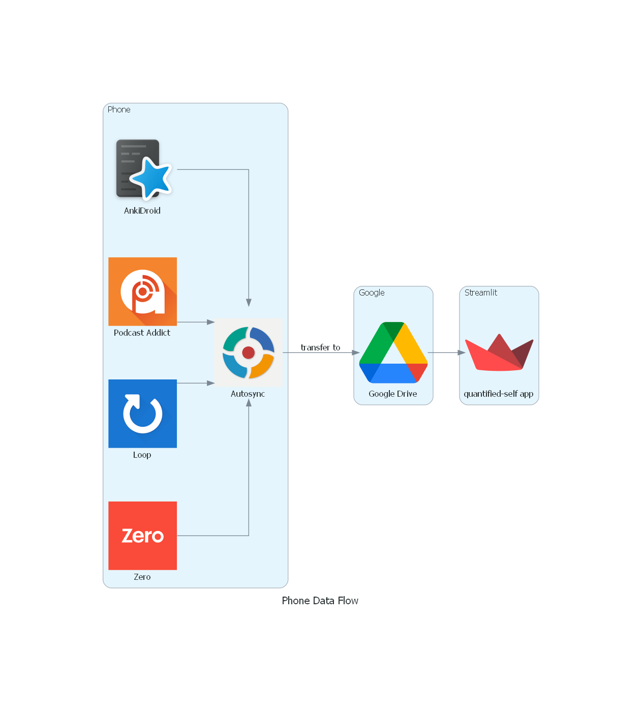
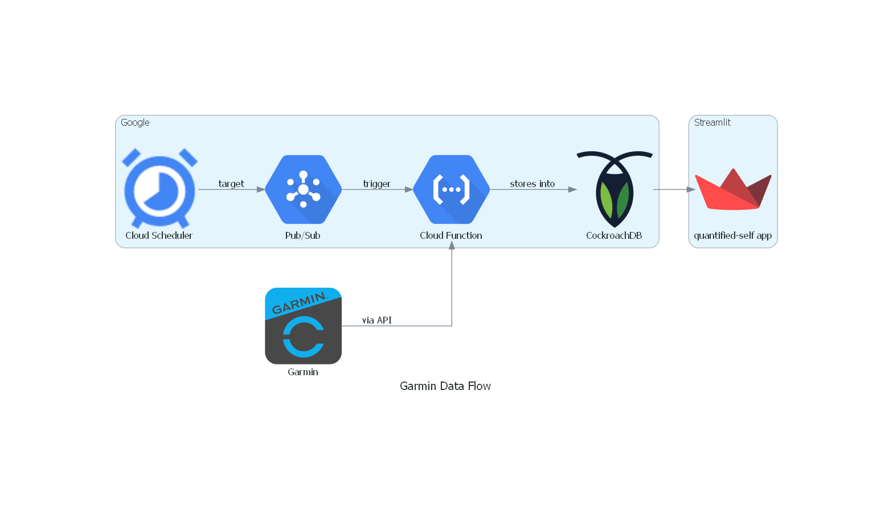

# Quantified Self
- [What is Quantified Self?](#what-is-quantified-self-)
- [Why am I doing this?](#why-am-i-doing-this)
- [Data collected](#data-collected)
- [Architecture](#architecture)

## What is Quantified Self?

The quantified self is the use of self-measurement tools and technologies with the aim of improving one's self knowledge. Data can be acquired through several means including:
- Smart watches
- Sleep trackers
- Fitness apps
- Mood trackers
- HR monitors

For a more detailed introduction to quantified self, you can check the following sources:
- [Wikipedia: Quantified Self](https://en.wikipedia.org/wiki/Quantified_self)
- [quantifiedself.com](https://quantifiedself.com/)
- [How Is Felix](https://howisfelix.today/?)

## Why am I doing this?
This project has multiple goals:
- Experiment quantified self.
- Reclaim ownership of my personal data.
- Develop skills in cloud technologies (GCP) and web apps (streamlit).

# Data collected
Data come from various sources. Ticked boxes correspond to data that can already be accessed (collectors developped).
## Health data
### Google Fit: step history from 2019 until switched to Garmin
- [x] Steps
### Garmin: Venu 2 Plus since Aug 2022
- [x] Steps
- [x] Stress
- [X] Heart Rate
- [ ] Respiration
- [ ] Activities
- [x] Hydration
- [x] Daily stats
- [x] Sleep
- [x] Weight
### Intermittent Fasting
- [x] [Zero](https://play.google.com/store/apps/details?id=com.zerofasting.zero): an app I used to track my period of fasting, since July 2022.

## Transportation data
- [x] Car
- [x] Train
- [x] Plane

## Listening history
- [x] [Podcast Addict](https://podcastaddict.com/): Podcast player that I use since 2017.
- [ ] [Spotify](spotify.com/): I have a subscription since 2017.

## Finance
- [x] [My Stock Portfolio](https://play.google.com/store/apps/details?id=co.peeksoft.stocks&hl=en&gl=US): to track my stock investments.

## Digital activity
- [ ] [ActivityWatch](https://activitywatch.net/): tracking my computer and phone usage, since June 2022.

## Vocabulary
- [x] [Anki](https://play.google.com/store/apps/details?id=com.ichi2.anki): a flashcard app that I have been using to learn Mandarin and English vocab for 832 days in a row (and counting!).

## Manual logging
- [ ] [Loop Habit Tracker](https://play.google.com/store/apps/details?id=org.isoron.uhabits): used to track various non automatable metrics such as coffee, alcohol, cold showers, feeling sick/headache/hot/cold.
- [ ] Personal Timeline: used to track various non automatable metrics such as place of residency, workplace, vacations etc.  

# Architecture
## From Phone
All the apps I want to collect data from have a backup function. Some of them can also perform backups on a schedule. I use [Autosync](https://play.google.com/store/apps/details?id=com.ttxapps.drivesync) to synchronize these backup files onto my Google Drive account. 

> Note: even though most Android apps write backup files on Google Drive, these files are hidden from the user and complex to access ([see here](https://stackoverflow.com/questions/22832104/how-can-i-see-hidden-app-data-in-google-drive)).

## From APIs
I chose [Google Cloud Functions](https://cloud.google.com/functions) to deploy the code that will run on a schedule to collect data through the Garmin API.

Cloud Functions are free within certain limits: maximum 2 million invocations, 400 000 GB-seconds, 200 000 GHz-seconds of compute time and 5GB of outbound trafic per month. In other words, this is equivalent to 55 hours of compute on 1 vCPU with 2GB of memory. 

In practice, most Cloud Functions can run on .167 vCPU and 256MB of memory, then the Free Tier is providing almost 2 weeks of compute 24/7. The typical workflow here will be scheduled run of API calls once a day. It will be well within the allocation of the Free Tier.

## Streamlit App
I use streamlit to build my [app](https://hugolmn-quantified-self-streamlit-app-75audf.streamlitapp.com/). 

Why streamlit?
- No infrastructure to manage.
- App deployed from a Github repository within seconds after each commit.
- Focus on the logic.
- Free.
> Disclaimer: I have no ties with Streamlit, these arguments are solely based on my experience working with it.
## Diagrams
### Phone Data Flow

### Garmin Data Flow

