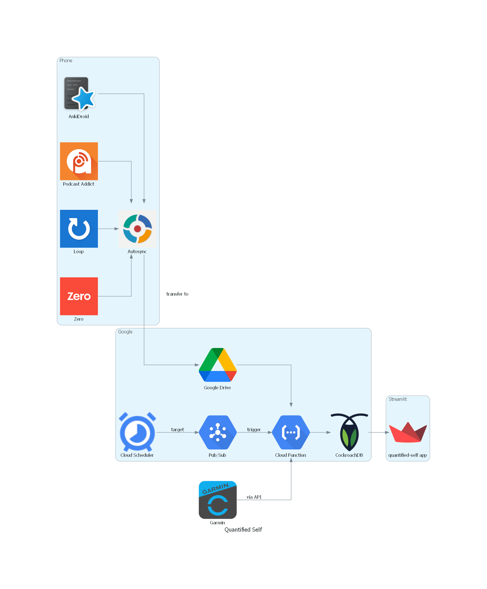

# Quantified Self

## What is Quantified Self ?

The quantified self is the use of self-measurement tools and technologies with the aim of improving one's self knowledge. Data can be acquired through several means including:
- Smart watches
- Sleep trackers
- Fitness apps
- Mood trackers
- HR monitors

For a more detailed introduction to quantified self, you can check the following sources:
- [Wikipedia: Quantified Self](https://en.wikipedia.org/wiki/Quantified_self)
- [quantifiedself.com](https://quantifiedself.com/)
- [How Is Felix](https://howisfelix.today/?)

## Why am I doing this?
This project has multiple goals:
- Experiment quantified self.
- Reclaim ownership of my personal data.
- Develop skills in cloud technologies (GCP) and web apps (streamlit).

# Data collected

## Health data
### Google Fit: step history from 2019 until switched to Garmin
- [ ] Steps
### Garmin: Venu 2 Plus since Aug 2022
- [ ] Steps
- [x] Stress
- [ ] Heart Rate
- [ ] Respiration
- [ ] Activities
### Intermittent Fasting
- [ ] [Zero](https://play.google.com/store/apps/details?id=com.zerofasting.zero): an app I used to track my period of fasting, since July 2022.

## Listening history
- [x] [Podcast Addict](https://podcastaddict.com/): Podcast player that I use since 2017.
- [ ] [Spotify](spotify.com/): I have a subscription since 2017.

## Digital activity
- [ ] [ActivityWatch](https://activitywatch.net/): tracking my computer and phone usage, since June 2022.

## Vocabulary
- [x] [Anki](https://play.google.com/store/apps/details?id=com.ichi2.anki): a flashcard app that I have been using to learn Mandarin and English vocab for 832 days in a row (and counting!).

## Manual logging
- [ ] [Loop Habit Tracker](https://play.google.com/store/apps/details?id=org.isoron.uhabits): used to track various non automatable metrics such as coffee, alcohol, cold showers, feeling sick/headache/hot/cold.

# Architecture
## Diagram
